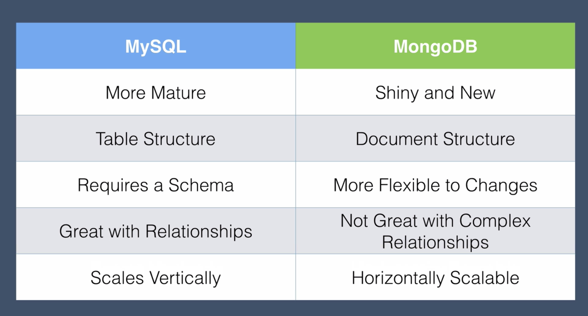

# The Complete 2020 Web Development Bootcamp (aka furry-goggles)

## Section 1: Front-End Web Development

- [Web Development Course Resources List](https://www.appbrewery.co/p/web-development-course-resources/)
How to Type Emojis
command + control + space

<hr> -> horizontal rule

## Section 4: Introduction to CSS

selector {property: value;}

## Display
- block
- inline
- inline-block
- none

- visibility: hidden;

### Common Inline Elements

- Span <span>
- Images 
- Anchors <a>

## Positioning

- Relative: to where element should have been
- Absolute: vis-a-vis parent element
- Fixed:

### Font Sizing

16px = 100% = 1em (the width of the capital letter M)
CSS3 - rem (root) - isn't affected by other settings

## CDN - content delivery network
- reduce latency

## Wireframe -> Mockup -> prototype (optional)


## CSS Z-Index and Stacking Order
- children sit on top of their parents
- HTML elements have a natural stacking order
- elements by default are position: static
- position: absolute takes elements out of HTML flow
- Z-Index by default is 0
- z-index: 1; brings the element closest to the user and farthest away from screen.
- z-index: -1; puts the element farthest away from user.
- position must be set to absolute, relative, or fixed to use the Z-Index; can't be the default static position.  
- review stacking order flowchart

## Media Query Breakpoints for Responsive Design
- Mobile First
- @media<type><feature>
- viewport: the size of the screen that image is being displayed on

## ID
- can be used to navigate site

## Code Refactoring
1. Readability
2. Modularity
3. Efficiency
4. Length

## Advanced CSS - Combining Selectors
- Multiple Selectors
h1, h2 {
  color: red;
}

- Hierarchical Selectors
#title .container-fluid {
  padding-top: 3%;
  text-align: left;
}

- Combined Selectors
h1.title {
  color: red;
}

## CSS - Selector Priority
1. #IDs
2. .classes
3. <elements>
- don't use inline style in your HTML

## JavaScript ES6

### keywords
alert("Hello");

### datatypes => typeof()
- strings
- numbers
- Boolean

### Methods
name.slice(x, y)

name.toUpperCase()

name.toLowerCase()

Increment++
Decrement--

### Loops
- while: checking state
- for: iterate

## Document Object Model (DOM)
get property
set property

Properties
- innerHTML
- style
- firstChild

Methods
- click()
- appendChild()
- setAttribute()

Higher Order Function - a function that takes another function as an input

document.addEventListener("keydown", respondToKey(event));

function respondToKey(event) {
  console.log("Key pressed.");
}

Callback Function - the function that gets passed in as an input

## Node.js

### REPL (Read Evaluation Print Loops)

hyosung11@HyoSungs-iMac node % node
Welcome to Node.js v12.13.1.
Type ".help" for more information.
> log
Thrown:
ReferenceError: log is not defined
> console.log("hi there!")
hi there!
undefined
> 3 + 5
8

To Exit
.exit or
control + C

### NPM - Node Package Manager

### Express - a node framework

### Section 19: Git, Github and Version Control

- commit messages in present tense convention
- git checkout to revert to previous version
- practice with branching
- Forking and Pulling Requests

### [git error fix](https://stackoverflow.com/a/19085954/11626863)

1. press 'i'
2. write merge message
3. press `esc`
4. write ':wq'
5. press `return`

## APIs - Application Programming Interface
- a set of commands, functions, protocols, and objects that programmers can use to create software or interact with an external system.
- It provides developers with standard commands for performing common operations so they don't have to write the code from scratch.
- APIs to interact with an external system.

### cURL - 'Client for URLs'

### JSON - data interchange format
- JavaScript Object Notation

### XML
- eXtensible Markup Language format

### API Calls with Parameters

### API Key - Authentication

## How to Remove node_modules
1. Create a .gitignore file in the git repository if it does not contain one
- touch .gitignore

2. Open up the .gitignore and add the following line to the file
- node_modules

3. Remove the node_modules folder from the git repository
- git rm -r --cached node_modules

4. Commit the git repository without the node modules folder
- git commit -m "Remove node_modules folder"

5. Push the repository to github
- git push origin master

6. After all of that, you should also add the gitignore and commit it to the repository

$git add .gitignore

$git commit -m "Updated the .gitignore file

$git push origin master

## EJS To Do List App
### Adding Pre-Made CSS Stylesheets to Your Website

## EJS Challenge Blog
### Express Routing Parameters

### Lodash - utility library

## Section 23: Databases

### Databases Explained: SQL vs. NoSQL

- SQL: Structured Query Language
  - Postgres and MySQL

- NoSQL: Not only Structured Query Language
  - mongoDB and redis

Working with node.js most popular databases


Structure
SQL: data in a table
- square off fields with 'null'
- structured
- relational (group related pieces of data into individual tables and link tables via IDs)

NoSQL: data represented as JSON objects
- data records don't have to be same shape or structure
- flexible
- non-relational (use references, can get repetitive and clumsy and not as efficient or fast as a SQL db)
- e.g., one to many relationship

Scalability
- NoSQL
- can be distributed



## Section 24: SQL

CRUD
Create
Read
Update
Destroy

## Section 25: MongoDB

### Installing MongoDB on Mac - [x]

- `/Users/hyosung11/data/db` location of database

#### Terminal Commands

- `brew services start mongodb-community`
- `brew services stop mongodb-community`
- `ps aux | grep -v grep | grep mongod`
- `ps -A | grep mongod` stops mongodb processes
- `sudo pkill -f mongod`

### [MongoDB CRUD Operations in the Shell](https://docs.mongodb.com/manual/crud/)

#### Create

```bash
> show dbs
admin   0.000GB
config  0.000GB
local   0.000GB
> use shopDB
switched to db shopDB
> show dbs
admin   0.000GB
config  0.000GB
local   0.000GB
> db
shopDB
> db.products.insertOne({_id:1, name: "Pen", price: 1.20})
{ "acknowledged" : true, "insertedId" : 1 }
> show collections
products
> db
shopDB
> db.products.insertOne({_id:2, name: "Pencil", price: 0.80})
{ "acknowledged" : true, "insertedId" : 2 }
>
```

#### Reading & Queries

```bash
> db.products.find()
{ "_id" : 1, "name" : "Pen", "price" : 1.2 }
{ "_id" : 2, "name" : "Pencil", "price" : 0.8 }
> db.products.find({name: "Pencil"})
{ "_id" : 2, "name" : "Pencil", "price" : 0.8 }
> db.products.find({price: {$gt: 1}})
{ "_id" : 1, "name" : "Pen", "price" : 1.2 }
> db.products.find({_id: 1}, {name: 1})
{ "_id" : 1, "name" : "Pen" }
> db.products.find({_id: 1}, {name: 1, _id: 0})
{ "name" : "Pen" }
> 
```

#### Update

```bash
> db.products.updateOne({_id: 1}, {$set: {stock: 32}})
{ "acknowledged" : true, "matchedCount" : 1, "modifiedCount" : 1 }
> db.products.find()
{ "_id" : 1, "name" : "Pen", "price" : 1.2, "stock" : 32 }
{ "_id" : 2, "name" : "Pencil", "price" : 0.8 }
> db.products.updateOne({_id: 2}, {$set: {stock: 12}})
{ "acknowledged" : true, "matchedCount" : 1, "modifiedCount" : 1 }
> db.products.find()
{ "_id" : 1, "name" : "Pen", "price" : 1.2, "stock" : 32 }
{ "_id" : 2, "name" : "Pencil", "price" : 0.8, "stock" : 12 }
>
```
#### Delete

```bash
> db.products.deleteOne({_id: 2})
{ "acknowledged" : true, "deletedCount" : 1 }
> db.products.find()
{ "_id" : 1, "name" : "Pen", "price" : 1.2, "stock" : 32 }
>
```

### Relationships in MongoDB

```bash
> db.products.insert(
...   {
...     _id: 3,
...     name: "Rubber", 
...     price: 1.30,
...     stock: 43,
...     reviews: [
...       {
...         authorName: "Sally",
...         rating: 5,
...         review: "Best rubber ever"
...       },
...       {
...         authorName: "John",
...         rating: 5,
...         review: "Awesome rubber"
...       }
...     ]
...   }
... )
WriteResult({ "nInserted" : 1 })
> db.products.find()
{ "_id" : 1, "name" : "Pen", "price" : 1.2, "stock" : 32 }
{ "_id" : 3, "name" : "Rubber", "price" : 1.3, "stock" : 43, "reviews" : [ { "authorName" : "Sally", "rating" : 5, "review" : "Best rubber ever" }, { "authorName" : "John", "rating" : 5, "review" : "Awesome rubber" } ] }
> db.products.insertOne(
...   {
...     _id: 2,
...     name: "Pencil", 
...     price: 0.8,
...     stock: 12,
...     reviews: [
...       {
...         authorName: "Omi",
...         rating: 4,
...         review: "Nice smooth feel in my hand"
...       },
...       {
...         authorName: "SungOh",
...         rating: 2,
...         review: "I didn't like the taste of the point."
...       }
...     ]
...   }
... )
WriteResult({ "nInserted" : 1 })
> db.products.find()
{ "_id" : 1, "name" : "Pen", "price" : 1.2, "stock" : 32 }
{ "_id" : 3, "name" : "Rubber", "price" : 1.3, "stock" : 43, "reviews" : [ { "authorName" : "Sally", "rating" : 5, "review" : "Best rubber ever" }, { "authorName" : "John", "rating" : 5, "review" : "Awesome rubber" } ] }
{ "_id" : 2, "name" : "Pencil", "price" : 0.8, "stock" : 12, "reviews" : [ { "authorName" : "Omi", "rating" : 4, "review" : "Nice smooth feel in my hand" }, { "authorName" : "SungOh", "rating" : 2, "review" : "I didn't like the taste of the point." } ] }
>
```

#### Relating Products to an Order

```bash
{
  _id : 1,
  name: "Pen",
  price: 1.20,
  stock: 32
}

{
  _id : 2,
  name: "Pencil",
  price: 0.80,
  stock: 12
}

{
  orderNumber: 3243,
  productsOrdered: [1, 2]
}
```

### Working with the Native MongoDB Driver

- Use the MongoDB native driver
- Use ODM (Object Document Mapper) called mongoose

## Section 26: Mongoose

### Introduction to [Mongoose](https://mongoosejs.com/)

- elegant mongodb object modeling for node.js

### Reading from Your Database with Mongoose

### Data Validation with Mongoose

### Updating and Deleting Data Using Mongoose

### Establishing Relationships and Embedding Documents Using Mongoose

## Section 27: Putting Everything Together

### Rendering Database Items in the ToDoList App

### Adding New Items to Our ToDoList Database

### Deleting Items from Our ToDoList Database

### Creating Custom Lists Using Express Route Parameters

